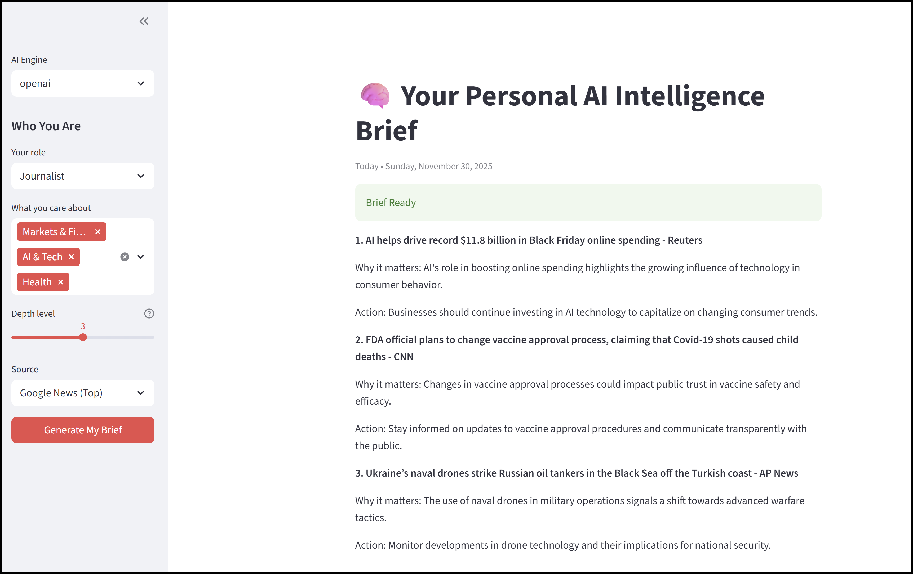

# Daily AI Intelligence Brief (Live Web App)

A personalized daily news brief powered by real RSS feeds and your choice of AI backend.

**Live Demo:** → [https://daily-ai-brief.streamlit.app](https://daily-ai-brief.streamlit.app)



### Features
- Real-time headlines from trusted sources (TechCrunch, BBC, NPR, Google News)
- Personalized to your **role** (Investor, CEO, Analyst, etc.) and **focus areas**
- Depth control (1 = quick scan, 5 = deep implications)
- One-line switch between **OpenAI**, **Gemini** (**Grok** will be added at a later time)
- 100% open source, runs locally or deployed

### Tech Stack
- Streamlit (instant web app)
- feedparser (reliable RSS)
- Multi-LLM backend (OpenAI GPT-3.5, Gemini 2.5, Grok-4)

### How to Run Locally
```bash
pip install -r requirements.txt
streamlit run daily_intel_brief.py

